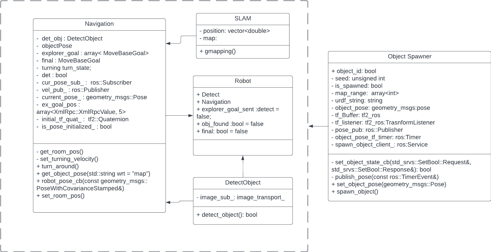

# Wall-E

[](https://opensource.org/licenses/MIT)
[](https://github.com/shaileshpranav/Wall-E/actions/workflows/CI.yml)
[](https://coveralls.io/github/shaileshpranav/Wall-E?branch=main)

**Course:** Software Development for Robotics  
**Code:** ENPM808X  
**Project No:** Final Project
**Semester:** Fall 2022  
**School:** A. James Clark School of Engineering, University of Maryland  

## Overview

Acme Robotics Inc. is a private company set to launch a trash collection robot. The robot is to be deployed in an office or any closed environment. It’s purpose is to detect and collect trash on the floor. So we the R&D team at Acme Robotics Inc., have come up with the first version of "Wall-E". It is capable of detecting and collecting trash as well as navigating in unknown closed environment. It identifies, moves towards the trash and collects it. The collected trash will then be transported to a common location for proper disposal.


## Authors

Our R&D team at Acme Robotics Inc. working on Wall-E are:
- [Shailesh Pranav Rajendran](https://github.com/shaileshpranav)
- [Harika Pendli](https://github.com/)
- [Aman Sharma](https://github.com/amancodeblast)

## Design and Development Process

We will be making use of ESC methodology for the initial design process which is by extraction of significant concepts. We identified the flow of the future program. Our software team worked on this project through iterative software evolution and service processes. Agile Development Process has been used in the development process with Test-Driven Development. 

Being a team of three programmers, we have decided to adopt pair programming roles:driver and navigator, along with a design keeper role. we have exchanged roles during different phases/ iterations (can be viewed in our work log).

## Algorithm and Methodology 

The whole concept of Wall-E in a nutshell is to  pick up trash in a closed environment. In our first version "Wall-E V1.0", Wall-E is capable of creating a map oof the environment it is released into, and pick up trash of a particular shape and kind. We have achieved this by bisecting the problem into components: detection and navigation. In Navigation, Wall-E first maps the whole closed-environment and stores the map. Once we have the map, we set the centre points in every room of the map and Wall-E moves to these locations on map and initiates the detection process. In the detection process, once it has reached the centre of the room, it spins to find trash (of a particular kind and shape), moves to that location and picks it up and moves to the next room. 

Assumptions:
* The environment is static. 
* Purple boxes of fixed size are considered to be trash.
* Trash is spawned randomly in different rooms.

Risks and Mitigation:
* If there is any sudden movement, mapping and localisation will be not as good as it is suppose to be.
* If the centres of rooms are not chosen properly, Wall-E might miss some trash boxes due to obstructive views. This can be mitigated by using different map and search packages.

Future work:

* Port the Software stack to original CAD model of the Wall-E bot to simulate its behavior.
* Work to improve the detection model to better identify, classify and the trash using DL based object detection node for identifying generalised trash.
* Improve the detection module to better localise the trash using transformations such that the attached arm can pick up the trash and dispose properly. 
* Improve the SLAM and navigation module to map and search for trash simultaneously and more robustly.
* Upgrade from ROS1 Noetic code base to ROS2 Humble code base.
* Deploy version "Wall-E V2.0" with all improvements and modifications mentioned above.

## UML Diagram


## Docments Deliverables
1. [Project Proposal](assests/Final_808X_proposal.pdf)

2. [AIP Sheet](https://docs.google.com/spreadsheets/d/1XeTO0CUpv6UCy624VYsgb07ksButBDdTZqp0TRLlJ4I/edit?usp=sharing) 

3. [Sprint Sheet](https://docs.google.com/document/d/11cLR52aRCAyYz1M3-HGVqCmaej5kUB9rt5mzMqc03yA/edit?usp=sharing)


## Build
- Create a workspace
```
mkdir -p ~/ros_ws/src
cd ~/ros_ws/src
```
- Clone the repository
```
git clone https://github.com/shaileshpranav/Wall-E.git
```
- Install dependencies
```
cd Wall-e
. install.bash
```
- Build the workspace
```
cd ~/ros_ws/src
catkin_make
source devel/setup.bash
```

## Launch
- Launch the simulation using Gazebo and Rviz
```
roslaunch wall-e simulation.launch
```

- To launch SLAM pipeline
```
roslaunch wall-e start_mapping.launch
```

- To Launch the simulation and to record a bag file 
```
roslaunch wall-e simulation.launch record_bag:=true
```

## Tests
To Build the Tests using catkin_make run following command in your catkin workspace.
```
catkin_make tests
```

To run the test execute following command.
```
rostest wall-e main_test.test
```

## License
```
MIT License

Copyright (c) 2022 Shailesh Pranav Rajendran

Permission is hereby granted, free of charge, to any person obtaining a copy
of this software and associated documentation files (the "Software"), to deal
in the Software without restriction, including without limitation the rights
to use, copy, modify, merge, publish, distribute, sublicense, and/or sell
copies of the Software, and to permit persons to whom the Software is
furnished to do so, subject to the following conditions:

The above copyright notice and this permission notice shall be included in all
copies or substantial portions of the Software.

THE SOFTWARE IS PROVIDED "AS IS", WITHOUT WARRANTY OF ANY KIND, EXPRESS OR
IMPLIED, INCLUDING BUT NOT LIMITED TO THE WARRANTIES OF MERCHANTABILITY,
FITNESS FOR A PARTICULAR PURPOSE AND NONINFRINGEMENT. IN NO EVENT SHALL THE
AUTHORS OR COPYRIGHT HOLDERS BE LIABLE FOR ANY CLAIM, DAMAGES OR OTHER
LIABILITY, WHETHER IN AN ACTION OF CONTRACT, TORT OR OTHERWISE, ARISING FROM,
OUT OF OR IN CONNECTION WITH THE SOFTWARE OR THE USE OR OTHER DEALINGS IN THE
SOFTWARE.
```
